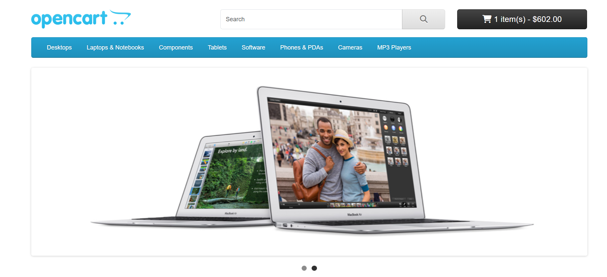
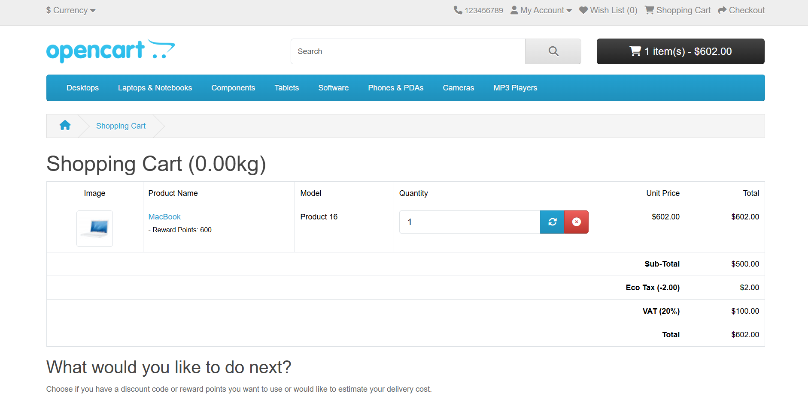

# 🐞 Bug Reporting Showcase: OpenCart UI Bug

This bug report was created as part of my self-learning journey as a **Customer Advocate** and **Technical Support Specialist**. The goal is to demonstrate my ability to:

- Identify real-world issues from a user perspective  
- Clearly document bugs using structured and standardized formats  
- Communicate effectively with developers, QAs, and engineers  

This project reflects how I break down issues into actionable insights — a critical skill when collaborating with product teams or writing support tickets that lead to resolution.

📌 **Bug in focus:** A UI issue in the [OpenCart demo](https://www.opencart.com/index.php?route=cms/demo) where the cart total displays a hyphen (-) once an item is being added.

---

## 🧠 Introduction

As a customer advocate, I serve as a bridge between stakeholders and customers. Writing crystal-clear bug reports strengthens my communication with QAs, software engineers, and developers, helping to resolve issues more efficiently.

---

## 📝 Bug Report Fields Used

1. **Title/Summary**  
2. **Steps to Reproduce**  
3. **Actual Result**  
4. **Expected Result**  
5. **Attachments**  
6. **Environment**  
7. **Bug Severity and Priority**  
8. **Assigned to**

---

## 🛠 Tools Used

- **Snipping Tool** – to capture visual evidence  
- **Git & GitHub** – for documentation and collaboration  
- **Jira** – bug tracking and workflow visualization  

---

## 📋 The Report

### ✅ Title/Summary  
**Desktop, Cart, Prod – Cart total displays a hyphen (-) with or without adding an item to the shopping cart.**

---

### 🔁 Steps to Reproduce  

1. Open the website: [OpenCart Demo](https://www.opencart.com/index.php?route=cms/demo)  
2. Click the **Store Front**  
3. Click on an item and select **Add to cart**  
4. View the **Shopping Cart** at the top-right corner of the screen  

---

### ❗ Actual Result  

- The cart total displays a hyphen (-) with or without adding an item to the shopping cart.  
- At checkout, the hyphen is omitted and the value becomes positive.

**The cart total at the top right corner of the screen**

**Cart checkout**

---

### ✅ Expected Result  

- There should be no hyphen (-) in the cart total.  
- The cart should accurately reflect the correct total whether or not items are added.

---

### 🖥 Environment

- **Operating System**: Windows  
- **Browser**: Chrome  
- **Browser Version**: `133.0.6943.142 (Official Build) (64-bit)`

---

### 🚨 Bug Severity

- **Critical** – This issue directly impacts user trust and checkout clarity.

---

### ⏳ Bug Priority

- **Medium** – While critical, the bug is UI-based and doesn't break core functionality.

---

### 👨‍💻 Assigned To

- Developers  

---

## 📸 Attachments

**The cart total at the top right**

**Checkout the cart**

---

## 💡 What I Learned

1.  Identified a real UI issue in a live product demo environment  
2.  Wrote structured, clear bug reports using expected vs actual results  
3.  Analyzed shopping cart behavior and logic  
4.  Improved cross-functional communication with technical stakeholders  
5.  Created a reusable reporting template for consistency

---

## 💡 Why Clear Bug Reporting Matters

Writing a clear, concise bug report is more than just documenting an error — it's a bridge between customer feedback, engineering solutions, and business impact. Here's why it's essential:

- 🔄 **Faster Resolution**: Engineers can reproduce and fix bugs quicker with well-structured reports, reducing turnaround time.
- 🙋🏽‍♀️ **Better Customer Experience**: Timely fixes lead to smoother user experiences, reducing frustration and improving satisfaction.
- 💸 **Reduced Costs**: Clarity saves time across QA, engineering, and support teams, minimizing resource waste.
- 🚀 **Product Improvement**: Detailed reports uncover patterns that help product teams prioritize improvements effectively.
- 🧠 **Cross-functional Collaboration**: Encourages alignment between customer-facing and technical teams.

According to [Zendesk](https://www.zendesk.com/blog/importance-of-good-bug-reporting/), clear reporting can reduce ticket resolution time by up to **50%**, directly impacting customer retention.

## 📚 Conclusion & Insights

### 🧩 Bug Reporting Essentials  

- **Title/Summary** should follow the **What / When / Where** format.  
- **Steps to Reproduce** must be clear, reproducible, and validated.  
- **Actual vs Expected Results** provide clarity for dev teams to isolate the issue.  
- **Attachments** enhance visibility for faster resolution.  
- **Environment Info** avoids guesswork and helps narrow down root causes.  
- **Bug Severity and Priority** reflect potential impact vs urgency.

### 🔁 Other Optional Fields to Consider:

- Version  
- Frequency/Reproducibility  
- Additional Notes  
- Workarounds  
- Timestamps  
- Product/Project Info  

---

## 🚀 Future Improvement

To enhance efficiency and scale bug reporting, this process could be automated or integrated with platforms like:

- **Zendesk** – Auto-log customer-reported issues into a tracking system  
- **HubSpot** – Link customer feedback to known issues  
- **Slack Alerts** – Automatically notify dev teams when high-priority bugs are logged

These tools improve turnaround time and foster real-time collaboration between support and engineering teams.

---

📌 **This project demonstrates my hands-on knowledge in identifying, documenting, and communicating bugs in real environments, using tools and workflows common in customer support and QA roles.**

